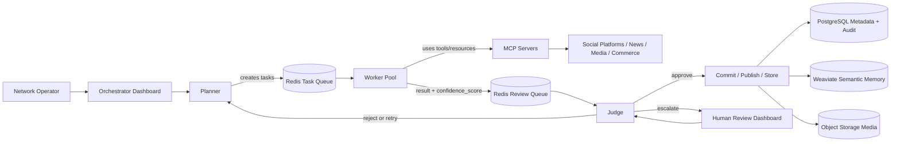
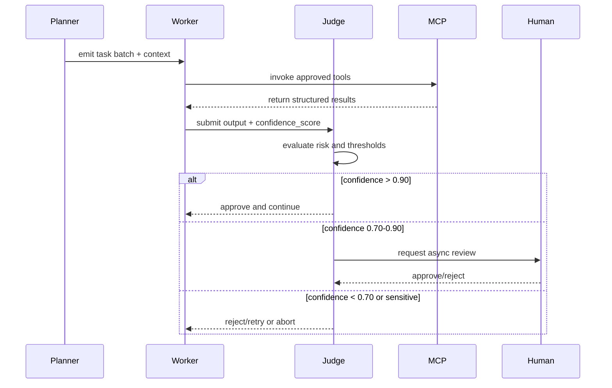

# Project Chimera Architecture Strategy

## Executive Summary

Project Chimera is designed as an Autonomous Influencer Network, not a basic content scheduler. The architecture must support agents that can perceive trends, plan campaigns, generate media, interact publicly, remember context, and operate under strict governance.

The recommended approach is a Hierarchical Swarm using the Planner -> Worker -> Judge pattern. This separates strategy, execution, and review so the system can scale work in parallel while keeping safety decisions centralized. External integrations are isolated behind MCP, and storage is split across PostgreSQL, Redis, Weaviate, and object storage based on the type of state being managed.

The main architectural priority is governed autonomy: Chimera should move quickly, but public actions, sensitive content, and financial decisions must remain reviewable, auditable, and reversible where possible.

## Architectural Goals

- Support persistent influencer agents that perceive trends, reason against campaign goals, and produce publishable content.
- Maintain auditability, tenant isolation, and traceable decisions for every agent action.
- Separate planning, execution, and review roles to limit blast radius and allow retries.
- Route all external platform and tooling access through MCP to reduce direct API risk.
- Use a hybrid data architecture that balances transactional consistency, queue performance, and semantic memory.
- Prepare for Java 21+ semantics with immutable DTOs, virtual threads, and optimistic concurrency control.

## Agent Pattern Decision

### Hierarchical Swarm vs Sequential Chain

A sequential chain executes tasks one after another with a single decision flow. It is simple, but it creates a bottleneck at the planner stage, makes retries harder, and mixes task creation with execution and review.

A hierarchical swarm organizes the solution into specialized layers and supports parallel task execution, explicit review, and bounded delegation. This pattern aligns more closely with Chimera's need for multiple concurrent influencer campaigns, quality assurance, and human escalation.

### Choosing Hierarchical Swarm

The Hierarchical Swarm pattern is the recommended architecture for Chimera because it:

- Enables parallel content generation and campaign execution.
- Provides a clean boundary between planning, execution, and judgment.
- Supports retries and selective escalation without collapsing responsibility.
- Fits the SRS requirement for governance and auditability.

### Rejected Alternatives

Sequential Chain was rejected because it creates a single narrow execution path and does not scale well for concurrent campaigns, comment replies, trend monitoring, and media generation.

Single Monolithic Agent was rejected because it mixes planning, tool execution, policy review, and memory updates into one component. That makes the system harder to test, harder to audit, and riskier when public-facing actions are involved.

Unrestricted Swarm was rejected because fully peer-to-peer agents can create coordination problems and unsafe emergent behavior. Chimera needs bounded autonomy with clear review and escalation paths.

### Planner, Worker, and Judge Responsibilities

Planner
- Decomposes high-level campaign and influencer goals into concrete, executable tasks.
- Produces task sets with objective, priority, and risk metadata.
- Assigns tasks to Workers and provides context from SOUL.md, campaign strategy, and persona constraints.
- Annotates tasks with expected confidence requirements and authorization scope.

Worker
- Executes atomic tasks using approved skills and MCP tools.
- Interacts with external systems only through the MCP boundary.
- Captures execution artifacts, intermediate outputs, and worker-side confidence estimates.
- Emits structured results and runtime trace data to the Judge.

Judge
- Reviews Worker outputs for quality, safety, policy compliance, and budget constraints.
- Applies approval logic, confidence thresholds, and escalation rules.
- Rejects, retries, or approves outputs before publication or downstream actions.
- Escalates medium-risk, low confidence, sensitive, or financial actions to the human-in-the-loop dashboard.

### State Consistency and OCC

The Judge is also responsible for protecting state consistency. Each task result should include the `state_version` or campaign snapshot version that existed when the Worker began execution. Before the Judge commits a result, it compares that version against the current global state.

If the state has changed, for example because a campaign was paused, a budget was exceeded, or a newer trend invalidated the task, the Judge rejects the stale result and sends it back to the Planner for re-evaluation. This follows Optimistic Concurrency Control and prevents agents from publishing or committing actions based on outdated context.

## Human-in-the-Loop Strategy

Human approval is placed in the Judge layer, where risk assessment and output validation are centralized. This keeps the core planner/worker flow autonomous while preserving a controlled escalation point for uncertain or sensitive actions.

Confidence thresholds:

- confidence_score > 0.90: auto-approve and continue execution.
- confidence_score 0.70-0.90: route to async human approval, keeping the task pending until an authorized reviewer responds.
- confidence_score < 0.70: reject and retry, or abort if the task cannot be safely recovered.

Sensitive topics always escalate regardless of score. Sensitive topics include:

- Politics
- Health advice
- Financial advice
- Legal claims

The Judge may also escalate financial actions to a specialized CFO Judge and enforce budget limits before any transaction proceeds.

## Data Architecture Strategy

For Chimera, high-velocity video metadata and campaign state require both transactional integrity and fast, distributed task state.

SQL vs NoSQL for high-velocity video metadata:

- SQL (PostgreSQL) provides structured schema, referential integrity, audit trails, and canonical source-of-truth behavior.
- NoSQL is attractive for wide, evolving metadata and fast writes, but it can weaken consistency and auditability for core campaign data.

Recommended hybrid approach:

- PostgreSQL is the system of record for canonical video/content metadata, including content IDs, agent ownership, campaign linkage, platform publication state, moderation status, audit references, and version history.
- Redis handles high-velocity operational state such as task queues, review queues, short-term memory, rate-limit counters, and temporary processing status.
- Weaviate stores semantic memory, persona context, trend embeddings, and similarity-searchable records that help agents reason about past interactions and content themes.
- Object storage holds generated media assets such as images, videos, thumbnails, and intermediate render artifacts. PostgreSQL stores references to these assets instead of storing the media directly.

This avoids forcing one database to handle every workload. PostgreSQL protects the authoritative record, Redis absorbs fast-changing state, Weaviate supports semantic retrieval, and object storage handles large binary assets.

## MCP Integration Strategy

MCP is the boundary layer for all external integrations. The agent core should not make direct API calls to social platforms, news sources, commerce systems, or media services.

Key principles:

- Expose external capabilities as tools and resources through MCP servers.
- Keep platform-specific logic, credentials, and rate-limit enforcement inside the MCP boundary.
- Require the Judge to validate MCP tool outputs before side effects are committed.
- Use MCP to centralize safe access to social APIs, news feeds, memory, media generation, and commerce functions.

This design reduces coupling, improves observability, and enforces the SRS constraint that the agent core remain isolated from direct external APIs.

## Governance and Safety

Governance is a first-class requirement in Chimera. The architecture should enforce:

- Auditability: capture planning decisions, worker execution traces, judge verdicts, and human review decisions in immutable logs.
- Budget control: enforce spending limits, transaction approvals, and CFO review for financial actions.
- Prompt-injection defense: validate task inputs, sanitize external messages, and treat incoming agent communications as untrusted data.
- Rate limits: throttle agent actions per tenant, platform, and MCP tool scope.
- Tenant isolation: keep agent state, metadata, memory, and budgets partitioned by customer or brand.
- AI disclosure: maintain transparency about agent identity, automation status, and the presence of AI-generated content.
- Spec alignment: every generated feature should trace back to `specs/` before implementation begins.
- Least privilege: Workers should only receive the MCP tools and permissions required for the specific task.
- Side-effect control: publishing, payment, and external communication actions should be blocked until Judge approval.
- Disclosure enforcement: public content should include AI labeling or identity disclosure where required.

Failure handling should include retries, rollback of side effects when possible, and safe aborts for unrecoverable or unsafe tasks.

## Mermaid Diagrams

### High-level Architecture Diagram

### Planner -> Worker -> Judge Flow Diagram

## Open Questions / Risks

- How will the system classify and detect sensitive topics consistently across Planner, Worker, and Judge?
- What is the exact human review workflow and SLA for async approval in a production influencer operation?
- How should financial transaction records be modeled if blockchain-ledger support is added later?
- Can the hybrid data model preserve performance for large-scale video metadata and tenant isolation without excessive operational complexity?
- What guardrails are required for agent-to-agent communication and social protocol messages in a public influencer network?

## Personal Architecture Rationale

This strategy is intentionally conservative on autonomy and strong on governance. The hierarchical swarm architecture matches the SRS and the need to separate campaign planning from execution and review. By using MCP for all external access and a hybrid data store for structured, temporal, and semantic state, Chimera can scale agent activity while keeping safety, auditability, and controlled escalation at the center of the design.