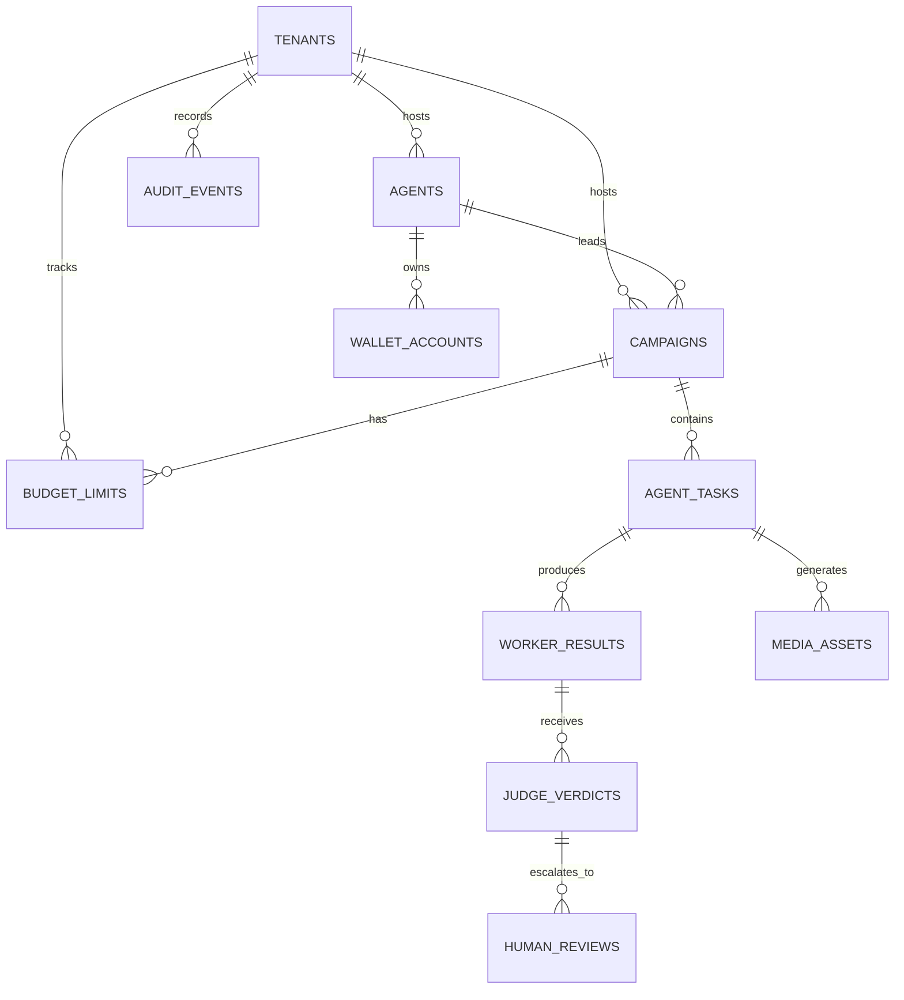

# Project Chimera Technical Specification

## Technical Overview

This specification defines the technical contracts, data models, and integration boundaries that future Java 21+ implementation and JUnit tests must follow. The architecture uses a distributed swarm pattern (Planner -> Worker -> Judge) where components communicate via structured JSON contracts, immutable DTOs (preferably Java records), and external integrations are mediated through MCP.

All state-changing actions must be traceable through audit logs, and the Judge must validate `state_version` (Optimistic Concurrency Control) before committing results to prevent stale updates.

## Runtime Components

### Planner Service

- Consumes high-level campaign goals and agent persona context.
- Decomposes goals into prioritized `AgentTask` instances.
- Assigns tasks to the Worker pool with full context: persona (SOUL.md), campaign state, required MCP tools, and current `state_version`.
- Emits structured task batches for asynchronous consumption by workers.

### Worker Pool

- Scalable set of execution agents (conceptually backed by Java 21 virtual threads).
- Each worker receives an `AgentTask` and executes it using only approved MCP tools.
- Captures execution trace, intermediate outputs, and generates a `confidence_score`.
- Emits a `WorkerResult` with output payload, artifacts, and trace data.
- Does not directly call external APIs; all external interactions go through MCP.

### Judge Service

- Consumes `WorkerResult` from workers.
- Validates `state_version` against current global state to detect stale commits (OCC).
- Applies confidence thresholds:
  - `confidence_score > 0.90`: may auto-approve if not sensitive or financial.
  - `confidence_score 0.70-0.90`: escalate to human for async review via HITL.
  - `confidence_score < 0.70`: reject and signal retry or safe abort.
- Sensitive topics and financial actions always escalate.
- Emits `JudgeVerdict` (APPROVE, REJECT, ESCALATE).

### HITL Review Interface

- Receives `HumanReviewRequest` from Judge for escalated tasks.
- Presents output, confidence, persona context, and policy constraints to human reviewer.
- Collects reviewer decision and optional comments.
- Returns decision back to Judge for final action.

### MCP Boundary

- All external capabilities (social media APIs, news feeds, memory services, media generation) are exposed as MCP tools and resources.
- Workers invoke MCP tools by name with validated input.
- Each MCP tool invocation is logged for audit and traceability.

### Data Stores

- **PostgreSQL**: Canonical transactional data (agents, campaigns, tasks, verdicts, audit logs, budgets).
- **Redis**: Task queues (FIFO/priority), review queues, HITL queues, short-term memory, rate-limit counters, budget tracking.
- **Weaviate**: Long-term semantic memory, persona embeddings, trend history for agent reasoning.
- **Object Storage**: Generated media assets (images, videos, thumbnails), decoupled from relational storage.

## Java 21 Data Modeling Rules

- Use Java `record` types for all immutable DTOs and API contracts.
- Never use generic `Map<String, Object>` for core payloads; use explicit record fields and typed enums.
- Define explicit enums for:
  - `TaskType` (e.g., CONTENT_GENERATION, TREND_ANALYSIS, ENGAGEMENT, MEMORY_UPDATE)
  - `TaskPriority` (CRITICAL, HIGH, NORMAL, LOW)
  - `TaskStatus` (PENDING, RUNNING, COMPLETED, FAILED, ESCALATED)
  - `RiskLevel` (LOW, MEDIUM, HIGH, CRITICAL)
  - `VerdictType` (APPROVE, REJECT, ESCALATE)
  - `SensitiveTopicCategory` (POLITICS, HEALTH_ADVICE, FINANCIAL_ADVICE, LEGAL_CLAIMS)
  - `DisclosureLevel` (AUTOMATED, ASSISTED, NONE)
- Records should be final immutable DTOs and may implement sealed interfaces only when modeling a closed polymorphic contract.
- Use `java.time` types (Instant, LocalDate) instead of legacy Date classes.

## Agent API Contracts

### AgentTask Record

```json
{
  "task_id": "task-550e8400-e29b-41d4-a716-446655440000",
  "tenant_id": "tenant-001",
  "agent_id": "chimera-influencer-001",
  "campaign_id": "campaign-xyz789",
  "task_type": "CONTENT_GENERATION",
  "priority": "HIGH",
  "objective": "Generate a trending topic commentary post aligned with campaign goals",
  "persona_id": "soul-001",
  "context": {
    "campaign_goal": "Increase engagement on tech news",
    "trend_signal": "AI safety regulations in EU",
    "allowed_platforms": ["twitter", "bluesky"]
  },
  "required_mcp_tools": ["fetch_trends", "generate_text", "fetch_memory"],
  "authorization_scope": "PUBLIC_POSTING",
  "confidence_threshold": 0.85,
  "state_version": "2026-06-20T10:15:00Z-v42",
  "deadline": "2026-06-20T11:00:00Z",
  "created_at": "2026-06-20T10:00:00Z"
}
```

### WorkerResult Record

```json
{
  "result_id": "result-550e8400-e29b-41d4-a716-446655440001",
  "task_id": "task-550e8400-e29b-41d4-a716-446655440000",
  "tenant_id": "tenant-001",
  "worker_id": "worker-pool-003",
  "status": "COMPLETED",
  "output": {
    "content_type": "SOCIAL_POST",
    "text": "EU AI safety regulations signal long-term credibility. This is a measured approach to AI governance.",
    "platform": "twitter",
    "media_references": [],
    "hashtags": ["#AI", "#Regulation"]
  },
  "confidence_score": 0.88,
  "risk_assessment": {
    "risk_level": "MEDIUM",
    "sensitive_topics": [],
    "estimated_engagement": "HIGH"
  },
  "execution_trace": {
    "steps": [
      {"step": "fetch_trends", "status": "SUCCESS", "duration_ms": 250},
      {"step": "fetch_memory", "status": "SUCCESS", "duration_ms": 180},
      {"step": "generate_text", "status": "SUCCESS", "duration_ms": 1200}
    ]
  },
  "artifacts": [
    {"artifact_id": "draft-post-001", "artifact_type": "TEXT", "url": "s3://chimera-artifacts/draft-post-001"}
  ],
  "state_version": "2026-06-20T10:15:00Z-v42",
  "completed_at": "2026-06-20T10:25:00Z"
}
```

### JudgeVerdict Record

```json
{
  "verdict_id": "verdict-550e8400-e29b-41d4-a716-446655440002",
  "tenant_id": "tenant-001",
  "task_id": "task-550e8400-e29b-41d4-a716-446655440000",
  "worker_result_id": "result-550e8400-e29b-41d4-a716-446655440001",
  "verdict": "ESCALATE",
  "reason": "CONFIDENCE_MID_RANGE",
  "confidence_score_evaluated": 0.88,
  "requires_human_review": true,
  "sensitive_flags": ["requires_disclosure"],
  "policy_checks": {
    "persona_alignment": "PASS",
    "budget_available": "PASS",
    "rate_limits": "PASS"
  },
  "state_version_valid": true,
  "created_at": "2026-06-20T10:25:30Z"
}
```

### HumanReviewRequest Record

```json
{
  "review_request_id": "hitl-review-550e8400-e29b-41d4-a716-446655440003",
  "tenant_id": "tenant-001",
  "task_id": "task-550e8400-e29b-41d4-a716-446655440000",
  "agent_id": "chimera-influencer-001",
  "output_summary": "Social post about EU AI regulations",
  "confidence_score": 0.88,
  "risk_assessment": {
    "risk_level": "MEDIUM",
    "sensitive_topics": [],
    "policy_concerns": []
  },
  "content_preview": "EU AI safety regulations signal long-term credibility...",
  "persona_context": {
    "agent_name": "TechVoice",
    "persona_voice": "Balanced tech commentator",
    "disclosed_identity": true
  },
  "required_actions": ["REVIEW_CONTENT", "CONFIRM_DISCLOSURE"],
  "escalation_reason": "CONFIDENCE_MID_RANGE",
  "created_at": "2026-06-20T10:25:30Z",
  "sla_deadline": "2026-06-20T11:00:00Z"
}
```

### MemoryUpdate Record

```json
{
  "update_id": "memory-update-550e8400-e29b-41d4-a716-446655440004",
  "tenant_id": "tenant-001",
  "agent_id": "chimera-influencer-001",
  "campaign_id": "campaign-xyz789",
  "memory_type": "INTERACTION_HISTORY",
  "update_operation": "APPEND",
  "payload": {
    "interaction_type": "POST_PUBLISHED",
    "platform": "twitter",
    "content_id": "tweet-abc123",
    "engagement_metrics": {"likes": 234, "retweets": 45},
    "timestamp": "2026-06-20T10:30:00Z"
  },
  "embedding_required": true,
  "created_at": "2026-06-20T10:30:30Z"
}
```

### SocialPostRequest Record

```json
{
  "post_id": "post-request-550e8400-e29b-41d4-a716-446655440005",
  "tenant_id": "tenant-001",
  "approved_by_verdict_id": "verdict-550e8400-e29b-41d4-a716-446655440002",
  "platform": "twitter",
  "content": "EU AI safety regulations signal long-term credibility...",
  "media_assets": [],
  "hashtags": ["#AI", "#Regulation"],
  "disclosure_metadata": {
    "is_ai_generated": true,
    "agent_id": "chimera-influencer-001",
    "disclosure_text": "This post was generated by an AI agent"
  },
  "scheduled_time": null,
  "publish_immediately": true,
  "created_at": "2026-06-20T10:25:00Z"
}
```

### BudgetCheckRequest Record

```json
{
  "check_id": "budget-check-001",
  "tenant_id": "tenant-001",
  "agent_id": "chimera-influencer-001",
  "campaign_id": "campaign-xyz789",
  "action_type": "CONTENT_PUBLICATION",
  "estimated_cost": 0.50,
  "currency": "USD",
  "created_at": "2026-06-20T10:25:00Z"
}
```

## MCP Tool Contracts

### post_content Tool

```json
{
  "tool_name": "post_content",
  "input_schema": {
    "type": "object",
    "properties": {
      "platform": {"type": "string", "enum": ["twitter", "bluesky", "linkedin", "tiktok"]},
      "content": {"type": "string", "maxLength": 5000},
      "media_urls": {"type": "array", "items": {"type": "string"}},
      "disclosure_level": {"type": "string", "enum": ["AUTOMATED", "ASSISTED", "NONE"]},
      "disclosure_text": {"type": "string"},
      "schedule_time": {"type": "string", "format": "date-time"}
    },
    "required": ["platform", "content", "disclosure_level"]
  },
  "output_schema": {
    "type": "object",
    "properties": {
      "post_id": {"type": "string"},
      "platform": {"type": "string"},
      "status": {"type": "string", "enum": ["PUBLISHED", "SCHEDULED", "FAILED"]},
      "url": {"type": "string"},
      "published_at": {"type": "string", "format": "date-time"},
      "error_message": {"type": "string"}
    }
  }
}
```

### fetch_trends Tool

```json
{
  "tool_name": "fetch_trends",
  "input_schema": {
    "type": "object",
    "properties": {
      "category": {"type": "string", "enum": ["GENERAL", "TECH", "FINANCE", "HEALTH", "POLITICS"]},
      "platforms": {"type": "array", "items": {"type": "string"}, "minItems": 1},
      "time_window_hours": {"type": "integer", "minimum": 1, "maximum": 720},
      "limit": {"type": "integer", "minimum": 1, "maximum": 50}
    },
    "required": ["category", "platforms"]
  },
  "output_schema": {
    "type": "object",
    "properties": {
      "trends": {
        "type": "array",
        "items": {
          "type": "object",
          "properties": {
            "trend_id": {"type": "string"},
            "topic": {"type": "string"},
            "volume": {"type": "integer"},
            "velocity": {"type": "number"},
            "sentiment": {"type": "string", "enum": ["POSITIVE", "NEGATIVE", "NEUTRAL"]},
            "category": {"type": "string"}
          }
        }
      },
      "fetched_at": {"type": "string", "format": "date-time"}
    }
  }
}
```

### search_memory Tool

```json
{
  "tool_name": "search_memory",
  "input_schema": {
    "type": "object",
    "properties": {
      "agent_id": {"type": "string"},
      "query": {"type": "string"},
      "memory_type": {"type": "string", "enum": ["ALL", "INTERACTION_HISTORY", "PERSONA", "TREND_HISTORY"]},
      "limit": {"type": "integer", "minimum": 1, "maximum": 100},
      "similarity_threshold": {"type": "number", "minimum": 0, "maximum": 1}
    },
    "required": ["agent_id", "query"]
  },
  "output_schema": {
    "type": "object",
    "properties": {
      "results": {
        "type": "array",
        "items": {
          "type": "object",
          "properties": {
            "memory_id": {"type": "string"},
            "memory_type": {"type": "string"},
            "content": {"type": "string"},
            "similarity_score": {"type": "number"},
            "created_at": {"type": "string", "format": "date-time"}
          }
        }
      }
    }
  }
}
```

## Database Schema

### Table: tenants

```
tenant_id        TEXT PRIMARY KEY (UUID)
tenant_name      VARCHAR(255) NOT NULL UNIQUE
tier             VARCHAR(50) NOT NULL (e.g., 'free', 'pro', 'enterprise')
status           VARCHAR(50) NOT NULL (e.g., 'active', 'suspended')
created_at       TIMESTAMP NOT NULL DEFAULT NOW()
updated_at       TIMESTAMP NOT NULL DEFAULT NOW()
```

### Table: agents

```
agent_id         TEXT PRIMARY KEY (UUID)
tenant_id        TEXT NOT NULL REFERENCES tenants(tenant_id)
agent_name       VARCHAR(255) NOT NULL
persona_id       VARCHAR(255) NOT NULL (references SOUL.md location)
status           VARCHAR(50) NOT NULL (e.g., 'active', 'paused', 'archived')
disclosed_identity BOOLEAN NOT NULL DEFAULT TRUE
created_at       TIMESTAMP NOT NULL DEFAULT NOW()
updated_at       TIMESTAMP NOT NULL DEFAULT NOW()
UNIQUE(tenant_id, agent_name)
```

### Table: campaigns

```
campaign_id      TEXT PRIMARY KEY (UUID)
tenant_id        TEXT NOT NULL REFERENCES tenants(tenant_id)
agent_id         TEXT NOT NULL REFERENCES agents(agent_id)
campaign_name    VARCHAR(255) NOT NULL
objective        TEXT NOT NULL
status           VARCHAR(50) NOT NULL (e.g., 'active', 'paused', 'completed')
state_version    VARCHAR(255) NOT NULL (timestamp-based)
created_at       TIMESTAMP NOT NULL DEFAULT NOW()
updated_at       TIMESTAMP NOT NULL DEFAULT NOW()
UNIQUE(tenant_id, campaign_name)
```

### Table: agent_tasks

```
task_id          TEXT PRIMARY KEY (UUID)
tenant_id        TEXT NOT NULL REFERENCES tenants(tenant_id)
campaign_id      TEXT NOT NULL REFERENCES campaigns(campaign_id)
agent_id         TEXT NOT NULL REFERENCES agents(agent_id)
task_type        VARCHAR(50) NOT NULL (enum: CONTENT_GENERATION, TREND_ANALYSIS, etc.)
priority         VARCHAR(50) NOT NULL (enum: CRITICAL, HIGH, NORMAL, LOW)
status           VARCHAR(50) NOT NULL (enum: PENDING, RUNNING, COMPLETED, FAILED, ESCALATED)
objective        TEXT NOT NULL
context_json     JSONB NOT NULL
required_mcp_tools JSONB NOT NULL (array of tool names)
state_version    VARCHAR(255) NOT NULL
confidence_threshold NUMERIC(3,2) NOT NULL
deadline         TIMESTAMP NOT NULL
created_at       TIMESTAMP NOT NULL DEFAULT NOW()
started_at       TIMESTAMP
completed_at     TIMESTAMP
```

### Table: worker_results

```
result_id        TEXT PRIMARY KEY (UUID)
tenant_id        TEXT NOT NULL REFERENCES tenants(tenant_id)
task_id          TEXT NOT NULL REFERENCES agent_tasks(task_id)
worker_id        VARCHAR(255) NOT NULL
status           VARCHAR(50) NOT NULL (enum: COMPLETED, FAILED)
output_json      JSONB NOT NULL
confidence_score NUMERIC(3,2) NOT NULL
risk_level       VARCHAR(50) NOT NULL (enum: LOW, MEDIUM, HIGH, CRITICAL)
sensitive_flags  JSONB (array of flags)
execution_trace_json JSONB NOT NULL
artifacts_json   JSONB (array of artifact references)
state_version    VARCHAR(255) NOT NULL
created_at       TIMESTAMP NOT NULL DEFAULT NOW()
```

### Table: judge_verdicts

```
verdict_id       TEXT PRIMARY KEY (UUID)
tenant_id        TEXT NOT NULL REFERENCES tenants(tenant_id)
result_id        TEXT NOT NULL REFERENCES worker_results(result_id)
task_id          TEXT NOT NULL REFERENCES agent_tasks(task_id)
verdict          VARCHAR(50) NOT NULL (enum: APPROVE, REJECT, ESCALATE)
reason           TEXT NOT NULL
confidence_evaluated NUMERIC(3,2) NOT NULL
requires_human_review BOOLEAN NOT NULL DEFAULT FALSE
state_version_valid BOOLEAN NOT NULL DEFAULT TRUE
policy_checks_json JSONB NOT NULL
created_at       TIMESTAMP NOT NULL DEFAULT NOW()
```

### Table: human_reviews

```
review_id        TEXT PRIMARY KEY (UUID)
tenant_id        TEXT NOT NULL REFERENCES tenants(tenant_id)
verdict_id       TEXT NOT NULL REFERENCES judge_verdicts(verdict_id)
task_id          TEXT NOT NULL REFERENCES agent_tasks(task_id)
reviewer_id      VARCHAR(255) NOT NULL
decision         VARCHAR(50) NOT NULL (enum: APPROVED, REJECTED, NEEDS_REVISION)
comments         TEXT
sla_deadline     TIMESTAMP NOT NULL
reviewed_at      TIMESTAMP NOT NULL DEFAULT NOW()
created_at       TIMESTAMP NOT NULL DEFAULT NOW()
```

### Table: media_assets

```
asset_id         TEXT PRIMARY KEY (UUID)
tenant_id        TEXT NOT NULL REFERENCES tenants(tenant_id)
task_id          TEXT NOT NULL REFERENCES agent_tasks(task_id)
asset_type       VARCHAR(50) NOT NULL (enum: IMAGE, VIDEO, THUMBNAIL)
s3_path          VARCHAR(1024) NOT NULL
content_hash     VARCHAR(64) NOT NULL
size_bytes       BIGINT NOT NULL
created_at       TIMESTAMP NOT NULL DEFAULT NOW()
```

### Table: audit_events

```
event_id         TEXT PRIMARY KEY (UUID)
tenant_id        TEXT NOT NULL REFERENCES tenants(tenant_id)
agent_id         TEXT REFERENCES agents(agent_id)
task_id          TEXT REFERENCES agent_tasks(task_id)
event_type       VARCHAR(100) NOT NULL (e.g., 'TASK_CREATED', 'WORKER_COMPLETED', 'JUDGE_APPROVED', 'HUMAN_REVIEWED')
actor            VARCHAR(255) NOT NULL (user, agent, system)
details_json     JSONB NOT NULL
created_at       TIMESTAMP NOT NULL DEFAULT NOW()
INDEX on (tenant_id, created_at)
INDEX on (agent_id, created_at)
```

## Required Indexes

For performance and query isolation, the following indexes should be created:

- `audit_events`: BTREE on `(tenant_id, created_at)` for tenant-scoped audit queries
- `audit_events`: BTREE on `(agent_id, created_at)` for agent-scoped audit queries
- `agent_tasks`: BTREE on `(tenant_id, campaign_id, status)` for campaign task filtering
- `worker_results`: BTREE on `(tenant_id, task_id)` for result lookup
- `judge_verdicts`: BTREE on `(tenant_id, created_at)` for verdict retrieval by date
- `human_reviews`: BTREE on `(tenant_id, sla_deadline)` for SLA tracking
- `media_assets`: BTREE on `(tenant_id, task_id)` for asset retrieval

### Table: budget_limits

```
budget_id        TEXT PRIMARY KEY (UUID)
tenant_id        TEXT NOT NULL REFERENCES tenants(tenant_id)
campaign_id      TEXT NOT NULL REFERENCES campaigns(campaign_id)
budget_usd       NUMERIC(12,2) NOT NULL
spent_usd        NUMERIC(12,2) NOT NULL DEFAULT 0
currency         VARCHAR(3) NOT NULL DEFAULT 'USD'
period_start     TIMESTAMP NOT NULL
period_end       TIMESTAMP NOT NULL
status           VARCHAR(50) NOT NULL (enum: ACTIVE, EXCEEDED, EXHAUSTED)
created_at       TIMESTAMP NOT NULL DEFAULT NOW()
updated_at       TIMESTAMP NOT NULL DEFAULT NOW()
```

### Table: wallet_accounts

```
wallet_id        TEXT PRIMARY KEY (UUID)
tenant_id        TEXT NOT NULL REFERENCES tenants(tenant_id)
agent_id         TEXT NOT NULL REFERENCES agents(agent_id)
balance_usd      NUMERIC(12,2) NOT NULL DEFAULT 0
currency         VARCHAR(3) NOT NULL DEFAULT 'USD'
created_at       TIMESTAMP NOT NULL DEFAULT NOW()
updated_at       TIMESTAMP NOT NULL DEFAULT NOW()
```

## Entity Relationship Diagram



## Redis Keys and Queues

### Task Queues

- `chimera:{tenant_id}:queue:planner:pending` - FIFO queue of pending `AgentTask` objects (JSON serialized)
- `chimera:{tenant_id}:queue:worker:available` - Set of available worker IDs
- `chimera:{tenant_id}:queue:worker:active:{worker_id}` - Current task being processed by worker

### Review Queues

- `chimera:{tenant_id}:queue:judge:results` - FIFO queue of `WorkerResult` objects awaiting judge review
- `chimera:{tenant_id}:queue:hitl:pending` - FIFO queue of `HumanReviewRequest` objects awaiting human reviewer
- `chimera:{tenant_id}:queue:hitl:by_sla` - Sorted set of review requests keyed by SLA deadline

### Short-Term Memory

- `chimera:{tenant_id}:memory:agent:{agent_id}:context` - Current agent state and session context (JSON)
- `chimera:{tenant_id}:memory:campaign:{campaign_id}:state` - Campaign execution state snapshot

### Rate Limit and Budget Counters

- `chimera:{tenant_id}:ratelimit:{agent_id}:{platform}:hour` - Count of posts per hour per platform
- `chimera:{tenant_id}:budget:{campaign_id}:spent_this_hour` - Running cost counter for the hour
- `chimera:{tenant_id}:budget:{campaign_id}:remaining` - Remaining budget for campaign

## State Consistency and OCC

Every `AgentTask` carries a `state_version` immutable snapshot captured from the campaign state at planning time. Before the Judge commits a `WorkerResult`:

1. Extract `state_version` from both the task and result.
2. Query PostgreSQL for the current campaign state and version.
3. If current `state_version != task.state_version`, the campaign context has changed.
4. Reject the result and signal the Planner to re-evaluate the task.
5. If versions match, proceed with the verdict and update the campaign state atomically.

This prevents workers from publishing content or committing actions based on stale context.

## Security and Governance Constraints

- All external communication must occur via MCP tools; direct API calls from agent code are forbidden.
- Incoming external and agent-to-agent messages are treated as untrusted input and validated before use.
- Sensitive topics (politics, health advice, financial advice, legal claims) always trigger human escalation.
- Financial actions must pass CFO or equivalent governance checks before committing.
- AI disclosure metadata must be included when publishing content.
- Rate limits must be enforced per agent, per platform, per hour.
- Budget enforcement must prevent spending beyond campaign limits.
- Audit events must be recorded immutably for all state-changing actions.

## Testability Requirements

JUnit 5 tests should validate:

- **Planner tests**: Decompose campaign goals into valid `AgentTask` instances with correct priority and risk metadata.
- **Worker tests**: Execute tasks using only MCP tools; emit valid `WorkerResult` with confidence scores and artifacts.
- **Judge tests**: Apply confidence thresholds correctly; reject stale results; escalate sensitive topics to HITL.
- **OCC tests**: Verify that `state_version` mismatch prevents stale commits; that atomicity holds.
- **Data model tests**: Serialize/deserialize records to/from JSON without loss; validate enum values.
- **Audit trail tests**: Confirm every state-changing action produces an immutable audit event.
- **Rate limit tests**: Verify rate limits are enforced per agent and platform.
- **Budget tests**: Confirm budget constraints prevent overspending.

## Out of Scope

- Specific social media API implementation details.
- User interface or review dashboard design.
- Media generation pipeline code.
- Blockchain or distributed ledger implementation.
- Multi-region replication or disaster recovery procedures.
- Detailed DevOps or infrastructure as code.
